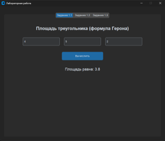
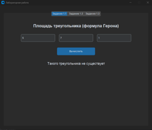
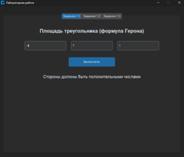
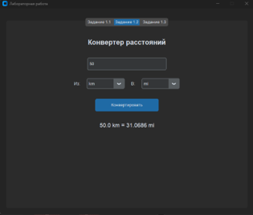
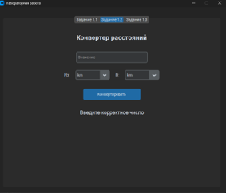
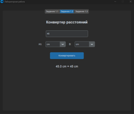
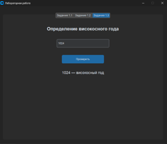
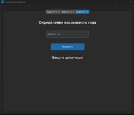
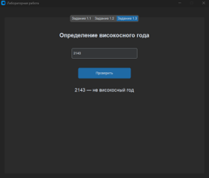

# Лабораторная работа №1 Операторы ввода/вывода. Условный оператор

Графическое приложение на Python, реализующее три математические и логические задачи с использованием интерфейса на базе библиотеки CustomTkinter.

Приложение разделено на три вкладки:
1. **Площадь треугольника**: Вычисление площади треугольника по трем сторонам с использованием формулы Герона. Включена проверка на корректность введенных данных и существование треугольника.
2. **Конвертер расстояний**: Перевод значений между различными единицами измерения длины (километры, метры, сантиметры, миллиметры, мили, ярды).
3. **Високосный год**: Проверка введенного года на високосность.

Для работы приложения требуется Python 3 и библиотека `customtkinter`. Стандартная библиотека `math` используется для математических вычислений.

## Среда разработки
Язык программирования: Python.
Среда разработки: Visual Studio Code.
Библиотеки: customtkinter, math.

## Установка и запуск

1. Установите необходимую библиотеку для создания графического интерфейса:
```bash
pip install customtkinter
```

2. Запустите главный файл приложения:
```bash
python main.py
```

## Инструкция по работе

Пользователь в графическом интерфейсе выбирает одну из трёх выполняемых задач, вводит данные в поля ввода и нажимает на кнопки: "Вычислить", "Конвертировать", "Проверить".

Условия для функционирования первой задачи:
Пользователь должен корректно ввести 3 стороны треугольника, в случае неправильного ввода программа выдаст ошибку и попросить ввести корректные данные

Условия для функционирования второй задачи:
Пользователь должен корректно ввести числовое значение и выбрать из какой в какую величину он хочет конвертировать число, в случае неправильного ввода программа выдаст ошибку и попросить ввести корректные данные.

Условия для функционирования третьей задачи:
Пользователь должен корректно ввести числовое значение любого года, в случае неправильного ввода программа выдаст ошибку и попросить ввести корректные данные.

## Результаты тестирования

### Задание 1.1 - Площадь треугольника

**Тест 1:** Ввод корректных значений сторон треугольника (3, 4, 5)
- Ожидаемый результат: Площадь равна 6.0
- Фактический результат: Соответствует ожидаемому



**Тест 2:** Ввод значений, при которых треугольник не существует (1, 2, 10)
- Ожидаемый результат: Сообщение "Такого треугольника не существует"
- Фактический результат: Соответствует ожидаемому



**Тест 3:** Ввод отрицательных значений (-5, 4, 3)
- Ожидаемый результат: Сообщение "Стороны должны быть положительными числами"
- Фактический результат: Соответствует ожидаемому



### Задание 1.2 - Конвертер расстояний

**Тест 1:** Конвертация 1 км в метры
- Ожидаемый результат: 1000 м
- Фактический результат: Соответствует ожидаемому



**Тест 2:** Конвертация 5 миль в километры
- Ожидаемый результат: approximately 8.04672 км
- Фактический результат: Соответствует ожидаемому



**Тест 3:** Конвертация 100 см в миллиметры
- Ожидаемый результат: 1000 мм
- Фактический результат: Соответствует ожидаемому



### Задание 1.3 - Високосный год

**Тест 1:** Проверка года 2024 (делится на 4, не делится на 100)
- Ожидаемый результат: "2024 — високосный год"
- Фактический результат: Соответствует ожидаемому



**Тест 2:** Проверка года 1900 (делится на 100, но не на 400)
- Ожидаемый результат: "1900 — не високосный год"
- Фактический результат: Соответствует ожидаемому



**Тест 3:** Проверка года 2000 (делится на 400)
- Ожидаемый результат: "2000 — високосный год"
- Фактический результат: Соответствует ожидаемому



## Вывод

В ходе выполнения лабораторной работы было разработано графическое приложение на языке Python с использованием библиотеки CustomTkinter. Приложение успешно реализует три задачи: вычисление площади треугольника по формуле Герона, конвертер расстояний между различными единицами измерения и определение високосного года по правилам григорианского календаря. Все тесты пройдены успешно, программа корректно обрабатывает как правильные, так и ошибочные входные данные.
